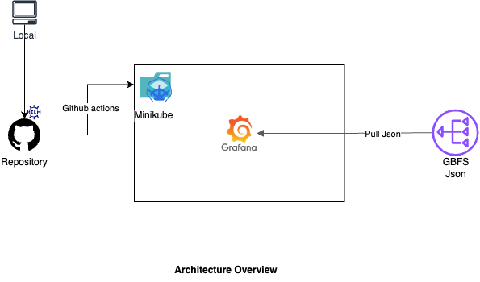

# GBFS Visualizer

## Description

GBFS is a simple standard for publishing bike sharing feeds. https://github.com/MobilityData/gbfs/blob/master/gbfs.md. The essence of this project is to design a solution to visualize select statistics provided by some of the GBFS providers.

## Architecture Overview

<center></center>

The project is designed in such a way that it integrates the json files as a datasource from the gbfs providers with the help of Grafana and refreshes every 30s. Each dashboard is designed and packaged using the helm package manager to install on any kubernetes platform. The stats being considered includes:

- System Information
- Station Status
- Station Information

Dashboards are configured as code, and new ones can be created by making a copy of any dashboard within `.grafana/dashboards/*.json`, replacing the the title of the dashboard, urls of the system information, station status and station information and running the upgrade command specified in the `Upgrades` section below.

## Getting Started

### Dependencies

* [Minikube](https://minikube.sigs.k8s.io/docs/) quickly sets up a local Kubernetes cluster on macOS, Linux, and Windows.
* [Helm](https://helm.sh/docs/) is the package manager for Kubernetes.
* [Docker](https://www.docker.com/) helps developers build, share, run, and verify applications anywhere.

### Installing

The project assumes you have a working installation of the dependencies listed above. Follow the instructions below to install them:

* [Minikube](https://minikube.sigs.k8s.io/docs/start/?arch=%2Fmacos%2Farm64%2Fstable%2Fbinary+download)
* [Helm](https://helm.sh/docs/intro/install/)
* [Docker](https://docs.docker.com/desktop/)
* [Git](https://git-scm.com/book/en/v2/Getting-Started-Installing-Git)

### Executing program

* Clone this repository:
```
git clone 
```
* Ensure docker is running on your PC
* Start a kubernetes instance:
```
minikube start
```

* Create namespace:
```
kubectl create ns monitoring
```

* Install the helm chart:
```
helm install -f grafana/values-production.yaml grafana grafana -n=monitoring
```

* Get your `gbfs-admin` user password by running:
```
kubectl get secret --namespace monitoring grafana -o jsonpath="{.data.admin-password}" | base64 --decode ; echo
```

* Expose the app service to the local system on port `5500`:
```
kubectl port-forward svc/grafana 5500:80 -n=monitoring
```

* Visit the app using the url `http://localhost:5500/dashboards` & login with the credentials from the previous step

### Upgrades

* For upgrades, update the `values-production.yaml` file & run `helm upgrade -f grafana/values-production.yaml grafana grafana -n=monitoring`

### Improvements(Things to change)

- Deploy to AWS EKS
- Build more dashboards for comparisons between providers.
- Setup alerting systems
